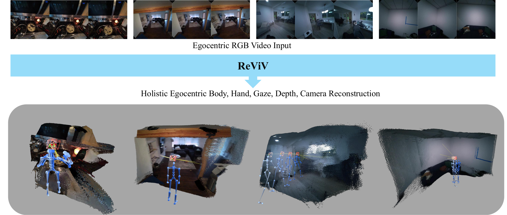

<div align="center">

<h1>ReViV: Reconstructing the Viewer and the View in 4D<br>from Monocular Egocentric Video</h1>

<h3>ECCV 2026</h3>

*[Xiaozhong Lyu](https://vlg.inf.ethz.ch/team/Xiaozhong-Lyu.html)\*, [Gen Li](https://ligengen.github.io/)\*, [Zhiyin Qian](https://vlg.inf.ethz.ch/team/Zhiyin-Qian.html), [Xucong Zhang](https://www.ccmitss.com/zhang), [Marc Pollefeys](https://people.inf.ethz.ch/marc.pollefeys/), [Siyu Tang](https://vlg.inf.ethz.ch/team/Prof-Dr-Siyu-Tang.html)*

\*Equal contribution

ETH Zürich · Delft University of Technology · Microsoft

[`Website`](https://reviv4d.github.io/) | [`Paper`](https://arxiv.org/pdf/2607.17790v1) | [`BibTeX`](#citation)

</div>

<br>

<p align="center">
  
</p>

<br>

Official implementation and pretrained models for **ReViV**.

ReViV is a unified framework for holistic egocentric 4D reconstruction: from a single monocular egocentric RGB video it jointly reconstructs the **viewer** (body and hand motion of the camera wearer) and the **view** (depth, camera trajectory and gaze) in one feed-forward pass. It is a Masked Generative Egocentric Transformer trained over the joint distribution of RGB video, depth, camera trajectory, gaze, body motion and hand motion, built on the [4M](https://github.com/apple/ml-4m) any-to-any framework and extending [EgoM2P](https://github.com/ligengen/EgoM2P) with body and hand motion tokenization.

## Table of contents
- [Usage](#usage)
  - [Installation](#installation)
  - [Data](#data)
  - [Tokenization](#tokenization)
  - [Training](#training)
  - [Inference](#inference)
- [Pretrained models](#pretrained-models)
- [License](#license)
- [Citation](#citation)

## Usage

### Installation

Create the conda environment directly from the repository:

```bash
conda env create -f environment.yaml
conda activate reviv
```

This installs Python 3.12, `torch` / `torchvision` (CUDA 12.4 wheels), `torch-scatter`, `decord`, and all remaining dependencies.

### Data

ReViV does not ship the datasets. Training assumes the data has been processed into fixed-length 60-frame **clips** (for the tokenizers) and pre-tokenized **WebDataset shards** (for the main model). See [README_DATA.md](README_DATA.md) for the expected on-disk layout.

### Tokenization

Continuous body and left/right hand motion is turned into discrete tokens by transformer VQ-VAEs trained with `run_training_vqvae.py`; camera trajectory and gaze use the same script with different configs, and RGB / depth video use the pretrained [NVIDIA Cosmos](https://github.com/NVIDIA/Cosmos) tokenizer (`cosmos_tokenizer/`). See [README_TOKENIZATION.md](README_TOKENIZATION.md).

### Training

Train the main any-to-any model with `run_training_reviv.py` on the pre-tokenized clips. The default config is a base-size SwiGLU transformer (12 encoder / 12 decoder layers, dim 768, ~400M parameters) covering RGB, depth, camera, gaze, body and hands. See [README_TRAINING.md](README_TRAINING.md).

### Inference

First download the Cosmos video tokenizer (gated HF repo — log in and accept the NVIDIA license first) and point the demos at a [released checkpoint set](#pretrained-models):

```bash
# 512 checkpoints use DV8x16x16; 256 checkpoints use Cosmos-0.1-Tokenizer-DV4x8x8
python cosmos_tokenizer/download_cosmos_tokenizer.py \
    --repo_id nvidia/Cosmos-1.0-Tokenizer-DV8x16x16 \
    --output_dir Cosmos/checkpoints/Cosmos-1.0-Tokenizer-DV8x16x16

export REVIV_CKPT_ROOT=/path/to/reviv_checkpoints/<set>   # or pass --ckpt_root
```

**RGB video → depth / camera / gaze / body** (`demo_infer.py`): encodes a 2 s window of the input video (any resolution / frame rate is resampled and center-cropped automatically), conditions ReViV on the tokens, and predicts + detokenizes all target modalities. The input pathway (512 vs 256) is picked automatically from the checkpoint: the **512** pathway conditions on the Cosmos tokens `tok_rgb_512` alone, the **256** pathway on `tok_rgb` plus the raw normalized clip `rgb@256`.

```bash
# single clip, or a folder (every video inside is processed, models load once)
python demo_infer.py --video /path/to/clip_or_folder --output_dir ./demo_output
```

Each clip's predictions land in `<output_dir>/<video_stem>/`: predicted depth as `.mp4` / `.npy`, and camera (`[60, 9]`), gaze (`[60, 2]`) and body (`[60, 21, 3]`) trajectories as `.npy` arrays at 30 fps. A copy of the input clip (and GT camera sidecars, when found next to the input) is placed alongside, so each output folder is self-contained. Use `--targets` to predict only a subset.

#### Worked example

The repository ships a short egocentric clip in [`example_data/`](example_data/) so the demos can be run end to end without downloading a dataset:

| File | Shape | Purpose |
|---|---|---|
| `example_video.mp4` | 2 s clip | input RGB video |
| `example_video_first_frame_cam.npy` | `[1, 4, 4]` | GT **first-frame** camera pose (world-to-camera), used to place the prediction in the GT world frame |
| `example_video_intrinsic.npy` | `[60, 3, 3]` | GT camera intrinsics, used to reproject the depth point cloud |

The two `.npy` files are optional GT sidecars: `demo_infer.py` finds them next to the clip, copies them into the output folder, and `demo_vis.py` then aligns the camera and body to the GT world frame and reprojects with the GT intrinsics. Without them the demos still run, using the raw prediction instead.

```bash
export REVIV_CKPT_ROOT=/path/to/reviv_checkpoints/metric_depth

python demo_infer.py --video example_data --output_dir ./example_data_output
python demo_vis.py   --prediction_dir ./example_data_output
# then open http://localhost:8080
```

**RGB video → hand motion** (`demo_hand.py`): predicts left/right hand joints `[60, 21, 3]` in camera space at 30 fps. GT joints (looked up as `<video_dir>/../gt_joints/<dataset>/<stem>.npz`) are copied alongside when available.

```bash
python demo_hand.py --video /path/to/clip_or_folder --output_dir ./demo_output_hand
```

**3D visualization** (`demo_vis.py`): interactive [viser](https://viser.studio) scene with the RGB-colored depth point cloud, predicted camera frustum, body skeleton and gaze ray.

```bash
python demo_vis.py --prediction_dir ./demo_output
# then open http://localhost:8080 (ssh -L 8080:localhost:8080 for remote machines)
```

**Hand overlay visualization** (`demo_vis_hand.py`): projects GT (red) and predicted (blue) hand joints onto the input clip and writes a browser-playable video. Camera intrinsics are resolved per clip from GT sidecars, [GeoCalib](https://github.com/cvg/GeoCalib) (`--geocalib`), or `--focal`.

```bash
python demo_vis_hand.py --input ./demo_output_hand            # overlay
python demo_vis_hand.py --input ./demo_output_hand --side_by_side
```

## Pretrained models

Two self-contained inference sets are released, both available from a single [polybox folder](https://polybox.ethz.ch/index.php/s/LHz64M2YnRo3CpL) (each set is a subfolder). Each contains the main model plus the five detokenizers (`reviv_main.pth`, `reviv_tok_{body,cam,gaze,lhand,rhand}.pth`) and a `norm_stats/` subfolder with the matching mean/std sidecars — point `REVIV_CKPT_ROOT` (or `--ckpt_root`) at one set and both demos work out of the box:

| Checkpoint set | Input | Predicts | Weights |
|---|---|---|---|
| `metric_depth/` | 32-frame 512×512 clip @ 16 fps (Cosmos DV8x16x16) | **metric 512×512 depth**, camera, gaze, body, hands | [Download](https://polybox.ethz.ch/index.php/s/LHz64M2YnRo3CpL) |
| `reviv_500b/` | 16-frame 256×256 clip @ 8 fps (Cosmos DV4x8x8) + raw clip | relative 256×256 depth, camera, gaze, body, hands | [Download](https://polybox.ethz.ch/index.php/s/LHz64M2YnRo3CpL) |

Detokenizers and norm stats must come from the same set as the main checkpoint they were trained with; codebook sizes differ between sets and are read from the main checkpoint automatically at load time, so no flags are needed when switching sets. Depth is detokenized with the NVIDIA Cosmos decoder (downloaded separately, see [Inference](#inference)).

## License

The code in this repository is released under the Apache 2.0 license (see [LICENSE](LICENSE)). It builds on [4M](https://github.com/apple/ml-4m), [EgoM2P](https://github.com/ligengen/EgoM2P) and the [NVIDIA Cosmos](https://github.com/NVIDIA/Cosmos) tokenizer, along with the projects listed in [ACKNOWLEDGEMENTS.md](ACKNOWLEDGEMENTS.md).

The model weights are released under the Sample Code License (see [LICENSE_WEIGHTS](LICENSE_WEIGHTS)), which permits non-commercial use only.

### Training data

The released model weights were derived from the following datasets: [Ego-Exo4D](https://ego-exo4d-data.org/), [HoloAssist](https://holoassist.github.io/), [HOT3D](https://facebookresearch.github.io/hot3d/) (Aria and Quest), [ARCTIC](https://arctic.is.tue.mpg.de/), [TACO](https://taco2024.github.io/), [H2O](https://taeinkwon.com/projects/h2o/), [EgoGen](https://ego-gen.github.io/) and [Nymeria](https://www.projectaria.com/datasets/nymeria/). Depth supervision consists of pseudo-labels generated with [Video Depth Anything](https://github.com/DepthAnything/Video-Depth-Anything). No dataset or derived annotation is redistributed in this repository.

Each dataset and model listed above is subject to its own license and terms of use, which are retained by their respective owners and apply independently of, and in addition to, the licenses granted here. Users are responsible for obtaining each dataset from its official source and for ensuring that their use complies with the applicable terms.

Use of the released model weights is limited to non-commercial research purposes.

## Citation

If you find this repository helpful, please consider citing our work:

```bibtex
@inproceedings{lyu2026reviv,
  title     = {ReViV: Reconstructing the Viewer and the View in 4D from Monocular Egocentric Video},
  author    = {Lyu, Xiaozhong and Li, Gen and Qian, Zhiyin and Zhang, Xucong and Pollefeys, Marc and Tang, Siyu},
  booktitle = {European Conference on Computer Vision (ECCV)},
  year      = {2026}
}
```
